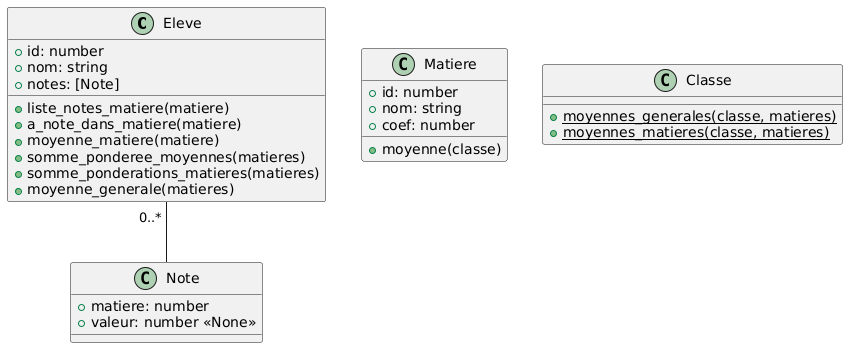

# Qualité de code et code de qualité

Problématiques de génie logiciel visant à garantir la qualité du logiciel mais aussi (et surtout) son suivi dans le
temps.

Une application doit être envisagée dans le temps, avec des évolutions prisent en charge par des développeurs différents.

La lisibilité du code et le contrôle de sa qualité doivent être des éléments majeurs du développement.

## Plan

* Qualité de code : PEP8
* Quelques bonnes pratiques de développement
* Faire des tests
* Cas pratique : pronote

## PEP8 : Style Guide for Python Code

[documentation de la PEP8](https://peps.python.org/pep-0008/)

Pourquoi suivre ces préconisations : **LISIBILITÉ DU CODE**

Remarque : les [Python Enhancement Proposals](https://peps.python.org/pep-0000/) permettent de suivre l'évolution du langage

## Quelques bonnes pratiques de développement

* Respecter les bonnes pratiques de qualité de code

  Utiliser un analyseur de code statique : [linuxfr.org](https://linuxfr.org/news/python-partie-9-formateur-de-code-analyse-statique)

  Les IDE (Pycharm, VSCode, VSCodium, ...) proposent des outils intégrés ou des modules à installer mettant directement en évidence les défauts de qualité de code

* Typer, tout, partout, tout le temps

  [PEP526 – Syntax for Variable Annotations](https://peps.python.org/pep-0526/)

* Respecter les 5 principes [SOLID](https://staff.cs.utu.fi/~jounsmed/doos_06/material/DesignPrinciplesAndPatterns.pdf) - [Robert C. Martin](https://en.wikipedia.org/wiki/Robert_C._Martin)
  
  * Single Responsibility Principle (SRP)
  * Open/Closed Principle (OCP)
  * Liskov Substitution Principle (LSP)
  * Interface Segregation Principle (ISP)
  * Dependency Inversion Principle (DIP)

  [Principes SOLID et comment les appliquer en Python](https://techblog.deepki.com/SOLID-in-python/)

* Se défendre contre les valeurs aberrantes ou dangereuses

  Toute information provenant d'une source extérieure est potentiellement aberrante, voire dangereuse

  En python, l'utilisation des asserts est un moyen d'éliminer les cas d'échec dès le début des fonctions ou méthodes

  L'intégration de données textuelles dans un site web ou une base de données DOIT être protégé contre les injections à l'aide de mécanismes interne aux api de gestion de BD ([Database API](https://peps.python.org/pep-0249/)) ou à l'utilisation des [fonctions d'échapements HTML](https://docs.python.org/fr/3/library/html.html))

  
  *[Exploits of a Mom - xkcd](https://xkcd.com/327/)*

  ```python
      username = request.values.get('username') # 'john OR TRUE ;--'
      password = request.values.get('password') # 'pouet'
      
      db = pymysql.connect(url_db)
      cursor = db.cursor()

    # Ne pas faire
      request = "SELECT * FROM users WHERE username = '%s' AND password = '%s'" % (username, password)
      cursor.execute(request)
    # qui injectera les variables username et password dans la chaîne sans contrôle avant d'exécuter la requète directement dans la BD
    # SELECT * FROM users WHERE username = 'john OR TRUE ;--' AND password = 'pouet'
    
    # Utiliser la DB API
      request = "SELECT * FROM users WHERE username = :uname AND password = :pwd"
      cursor.execute(request, ({uname: username, pwd: password},))
    # qui échapera les variables avant leur injection dans la chaîne de la requète
  ```

* Éviter les états invalides ou incohérents
  * Initialiser tous les attributs dès la construction d'une instance de classe

  ```python
    # Ne pas faire
    class A:
      def __init__(self):
        pass

      def set_user(my_user):
        self._user = my_user

      def send_user_email(self, message):
        send_email(self._user.email, message)

    # Préferer une initialisation forcée, sans setter
    class A:
      def __init__(self, user):
        self._user = user

      def send_user_email(self, message):
        send_email(self._user.email, message)

    # Ou bien l'injection de dépendance*
    class A:
      def __init__(self, value):
        pass

      def send_user_email(self, user, message):
        send_email(user.email, message)
  ```

  * Les interfaces publiques doivent permettrent de gérer l'intégralité du traitement

    Limiter les méthodes publiques au strict essentiel, et dans la mesure du possible, ne pas utiliser de propriété publique.
    Même si la restriction d'accès public/privé n'existe pas en python, utiliser les symboliques préconisées en mettant un '_' en début de chaque propriété privée pour indiquer l'usage purement interne d'une ressource.

  ```python
    class A:
      _private_props # utilisé pour la gestion interne de la classe.

      _ma_fonction() # usage interne

      ma_fonction_2() # interface publique
  ```

  * Utiliser des "Value Object"

  ```python
  class User:
    def __init__(self, email: str):
      self.email = email

  my_user = User("toto") # pas d'erreur
  ```
  
  Préférer

  ```python
  def class Email:
    def __init__(self, email: str)
      # assert email is an email
      self.email = email

  class User:
    def __init__(self, email: Email):
      self.email = email

  my_user = User(Email("toto@domain.fr")
  ```

* Écrire des fonctions pures : pas de dépendance extérieur à la fonction et pas de modification des paramètres

  Une fonction pure produit toujours le même résultat, quelque soit les conditions d'exécutions

  ```python
  # Ne pas faire !
  contacts = []
  def add_contact(email):
    contacts.append(User(Email(email)))

  # deux appels successifs produiront deux résultats différents
  add_contact("toto@domain.fr")
  # contacts => [User("toto@domain.fr")]
  add_contact("toto@domain.fr")
  # contacts => [User("toto@domain.fr"), User("toto@domain.fr")]

  # Ne pas faire non plus
  def add_contact(contacts, email):
    contacts.append(User(Email(email)))
  
  # qui produira le même effet
  ```

  ```python
  # une fonction pure ne dépend pas du contexte et ne modifie pas les paramètres

  def add_contact(contacts, email):
    new_contacts = copy.copy(contacts)
    return new_contacts.append(User(Email(email)))

  # deux appelles successifs produiront deux résultats identiques
  contacts2 = add_contact(contacts, "toto@domain.fr")
  # contacts2 => [User("toto@domain.fr")]
  contacts2 = add_contact(contacts, "toto@domain.fr")
  # contacts2 => [User("toto@domain.fr")]
  ```

* Utiliser un gestionnaire de projet qui vous aidera à gérer les dépendances : [poetry](https://python-poetry.org/)

  **Astuce** Avec ces outils vous pourrez bloquer les versions des outils et bibliothèques que vous utilisez, et en les distribuant à vos éléves, vous assurerez la reproductabilité des résultats des exercices

* Ne pas réinventer la roue, sauf... pour avoir une roue carrée !
  * d'autres ont surement déjà réfléchi à votre problème
  * Attention à bien gérer la dette technique

  
  *[Project dependency - xkcd](https://xkcd.com/2347/)*

## Faire des tests...

Votre application va probablement évoluer au cours du temps.  
Comment savoir que les modifications apportées ne vont pas créer des régressions ?  
Comment être sur que vos milliers de lignes de code fonctionne toujours dans toutes les situations ?  
Comment gérer de façon robuste les montées de version ?

**Si votre conception vous a amené à créer des classes et des méthodes, vous savez quelle est la responsabilité et donc le résultat attendu de chacune d'entre-elle !**

**C'est le principe des tests !**

* test unitaire / fonctionnelle

* test d'intégration / end-to-end


*unit tests vs integration tests*

* test front / web
  * utiliser un framework comme [sélénium](http://docs.seleniumhq.org/)
  * navigateur virtuel pour la création du DOM
  * Mise en place de scénario de navigation
  * test du contenu du DOM

* couverture de code : taux de code executé à travers les tests !
  * Exemple github :

* bonus : test de mutation
  * un bug peut-être lié à une instruction erronée : une mauvaise opération, un mauvais paramètre, un mauvais ordre d'instructions, ...
  * Si les tests sont complets, une erreur dans le coe doit tout de suite être détéctée par ces tests
  * traduction : Si le code "mute", les tests doivent le détecter et "tuer" les mutants !

## Cas pratique : Pronote

Bibliothèque, simpliste, de calcul des moyennes des éléves d'une classe

Réalisation des tests unitaires et fonctionnels avec la bibliothèque **[pytest](https://docs.pytest.org/en/stable/)**

Gestionnaire de projet : **[poetry](https://python-poetry.org/)**

Versionnage : [git](https://git-scm.com/)

### Description des données

```text
Classe: [ Éléve ]
Éléve: {
  identifiant,
  nom: chaîne de caractères,
  notes: [ Note ]
}
Note: {
  matière: identifiant,
  valeur_note: réèl | None
}
Matière: {
  identifiant,
  nom: chaîne de caractères,
  coef: nombre
}
```

### Diagrammes de classes


*power by [plantUML](https://plantuml.com/fr/)*

### Etape 1 : Premier Test (pédagogique)

But : Vérifier la structure et l'initialisation des classes

* Initialisation du projet avec poetry : ```poetry init```
* ajout de la bibliothèque *pytest* au projet : ```poetry add pytest```
* (Etape 1.1) Création des classes dans le répertoire src/
* (Etape 1.1) Création du fichier tests/test_structure.py
* lancement des tests en échec : ```poetry run pytest -v```
* (Etape 1.2) Création des premiers tests
* lancement des tests : ```poetry run pytest -v```

### Développement des fonctionnalités de la classe Eleve

#### Etape 2

* (Etape 2.1) Création du fichier tests/test_eleve.py
* (Etape 2.1) Ajout des tests de liste_notes_matiere
* lancement des tests en échec : ```poetry run pytest -v```
* (Etape 2.2) Écriture de la fonctionnalité validant les tests : **Développement Dirigé par les Tests** (DDT)
* lancement des tests : ```poetry run pytest -v```
* (Etape 2.3) Externalisation des données : les fixtures
* lancement des tests : ```poetry run pytest -v```

#### Etape 3

* (Etape 3.1) Moyenne matière avec bug
* lancement des tests : ```poetry run pytest -v```
* (Etape 3.2) Correction du bug
* lancement des tests : ```poetry run pytest -v```

#### Etape 4

* (Etape 4.1) Ajout des autres fonctionnalités
* (Etape 4.1) Ajout tests des autres fonctionnalités
* Remarque : moyenne_générale dépend d'autres fonctionnalités - tests fonctionnels
* Ajout de la bibliothèque pytest-mock : ```poetry add pytest-mock```
* (Etape 4.2) Mock somme_pondérée et somme_pondération
* (Etape 4.3) Mock moyenne_matière

#### Etape 5

* (Etape 5.1) Refactor Note : ajout coef et maj test_structure
* (Etape 5.2) Refactor liste_notes_matiere et moyenne_matiere
* lancement des tests en échec : ```poetry run pytest -v```.
  Dans le cas de liste d'objets, les tests compare les références !
* (Etape 5.3) Refactor des tests de liste_notes_matiere et moyenne_matiere => comparaison en profondeur de liste !
* lancement des tests : ```poetry run pytest -v```
* Ajout de coefficients aux notes des fixtures
* (Etape 5.4) Maj des tests pour valider les nouvelles données

### Développement des fonctionnalités des classes Classe et Matieres

#### Etape 6

* (Etape 6.1) ajout *json-server-py* et *bd.json*. *json-server* est un outil très pratique pour simuler très rapidement des apis de données REST
* Ajout de la bibliothèque *requests* pour simplifier les requètes *[Ajax](https://fr.wikipedia.org/wiki/Ajax_(informatique))* : ```poetry add requests```
* (Etape 6.1) Démarrage de l'api et consultattion des données : ```poetry run json-server api/db.json```
* (Etape 6.2) Test de Classe.moyennes_générales
* (Etape 6.3) Test de Classe.moyennes_matieres

### Test de mutation avec mutmut

* Ajout de la bibliothèque [mutmut](https://mutmut.readthedocs.io/en/latest/) : ```poetry add mutmut```
* Lancement des tests : ```poetry run mutmut run```
* browse du résultat : ```poetry run mutmut browse```

### Couverture de code avec [coverage](https://coverage.readthedocs.io/en/7.6.9/)

Observer la quantité de code couvert par les tests afin de détecter le code non testé

* Ajout de la bibliothèque *coverage* : ```poetry add coverage```
* Analyse de la couverture des tests: ```poetry run coverage run -m pytest```
* Génération des résultats en html : ```poetry run coverage html```
* Consultation des résultats *htmlcov/index.html* dans un navigateur

## Echanges ouvert si le temps le permet...
